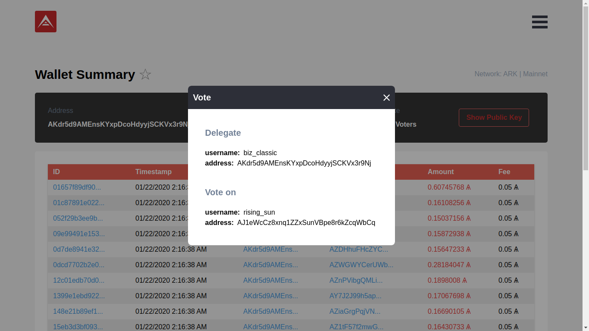
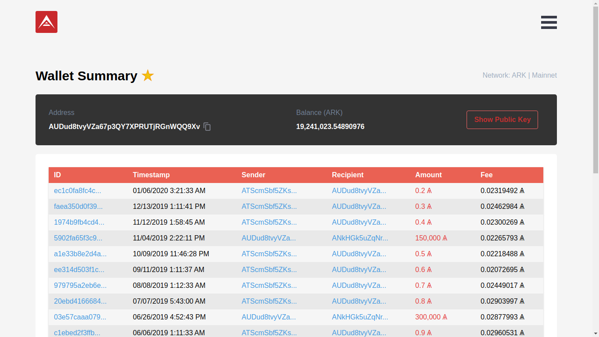
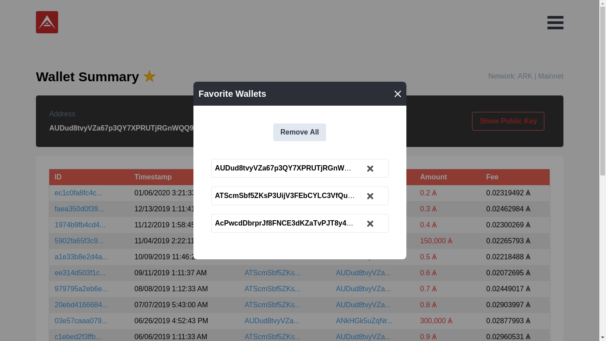
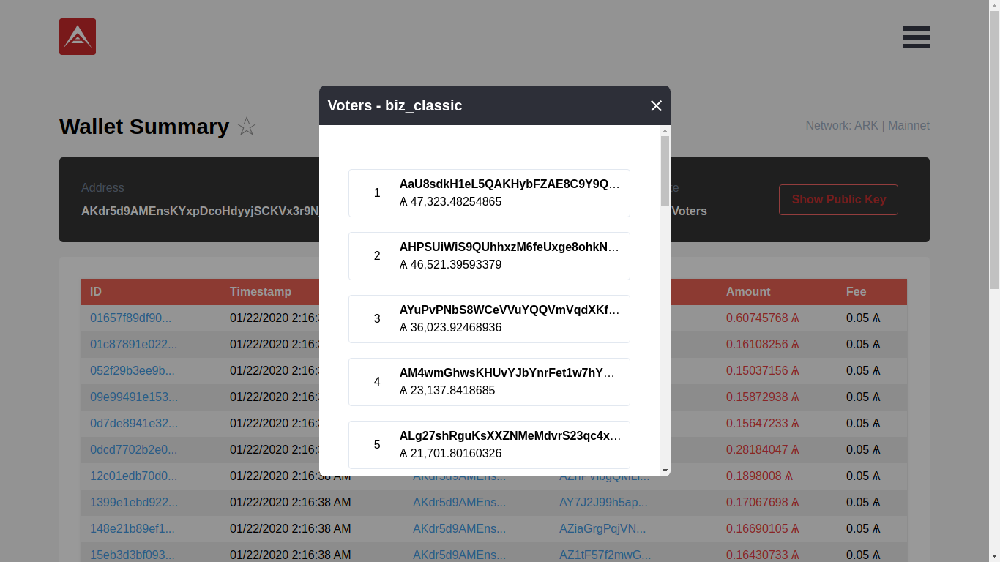
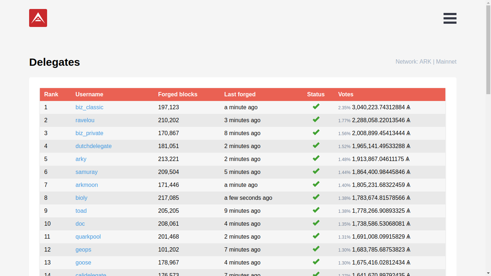
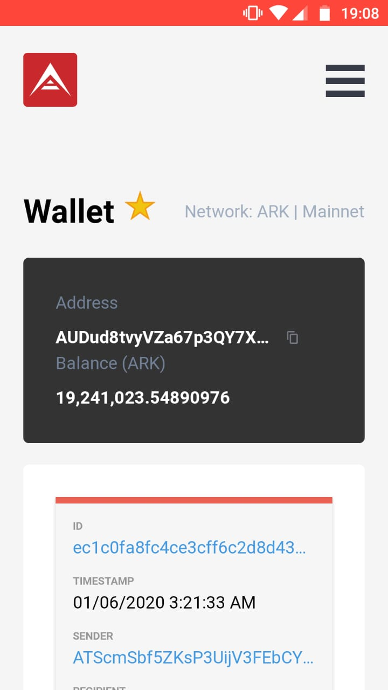

<h1 align="center">
  
</h1>

> ARK wallet challenge assignment

[](http://arkwallet.netlify.com/)

[](http://arkwallet.netlify.com)

### **Try the demo** → http://arkwallet.netlify.com

## Quick Start

First of all, install the dependencies to run this app.

- [NodeJS](http://nodejs.org/)
- [Yarn](https://yarnpkg.com/lang/en/docs/cli/install/)

```bash
# Clone this repository
$ git clone git@github.com:brenopolanski/ark-wallet.git

# Install dependencies
$ yarn install

# Compiles and hot-reloads for development
$ yarn serve

# Compiles and minifies for production
$ yarn build

# Lints and fixes files
$ yarn lint
```

## Technologies

| **Tech** | **Description** |
|----------|-----------------|
| [Vue.js](https://vuejs.org/) | The Progressive JavaScript Framework. |
| [Vue Router](https://router.vuejs.org/) | Vue Router is the official router for Vue.js. |
| [Vuex](https://vuex.vuejs.org/) | Vuex is a state management pattern + library for Vue.js applications. |
| [Tailwind CSS](https://tailwindcss.com/) | A utility-first CSS framework for rapidly building custom designs. |
| [v-tooltip](https://github.com/Akryum/v-tooltip) | Easy tooltips, popovers, dropdown for Vue 2.x. |
| [vue-clipboard2](https://github.com/Inndy/vue-clipboard2) | A simple vue2 binding to clipboard.js. |
| [Vue Loading Overlay Component](https://github.com/ankurk91/vue-loading-overlay) | Vue.js component for full screen loading indicator. |
| [Vue Toast Notification](https://github.com/ankurk91/vue-toast-notification) | Yet another toast notification plugin for Vue.js. |
| [NProgress](https://github.com/rstacruz/nprogress/) | For slim progress bars like on YouTube, Medium, etc. |
| [axios](https://github.com/axios/axios) | Promise based HTTP client for the browser and node.js. |
| [Moment.js](https://github.com/moment/moment/) | Parse, validate, manipulate, and display dates in javascript. |
| [niceware](https://github.com/diracdeltas/niceware) | Generate or convert random bytes into passphrases in Node and the browser. |
| [bignumber.js](https://github.com/MikeMcl/bignumber.js/) | A JavaScript library for arbitrary-precision decimal and non-decimal arithmetic. |
| [@arkecosystem/crypto](https://www.npmjs.com/package/@arkecosystem/crypto) | ARK - Crypto |

## Screenshots (see [mockups](./mockups))

### Browser App

|  |  |
| :---------------------------------------------------------: | :---------------------------------------------------------: |
|                      **Import Wallet**                      |                 **All / Top Wallets Modal**                 |

|  |  |
| :---------------------------------------------------------: | :---------------------------------------------------------: |
|                 **Network Settings Modal**                  |                    **Wallet Summary 1**                     |

|  |  |
| :---------------------------------------------------------: | :---------------------------------------------------------: |
|                    **Wallet Summary 2**                     |                          **Menu**                           |

|  |  |
| :---------------------------------------------------------: | :---------------------------------------------------------: |
|                  **Generate Wallet Modal**                  |                        **Delegates**                        |

### Mobile App

<p align="center">
  
  
  
  
</p>

## Contributing

If you want to help, please read the [Contributing](./CONTRIBUTING.md) guide.

## Credits

- [The ARK Crew](https://ark.io/team)

## License

[MIT License](https://brenopolanski.mit-license.org/) © Breno Polanski
