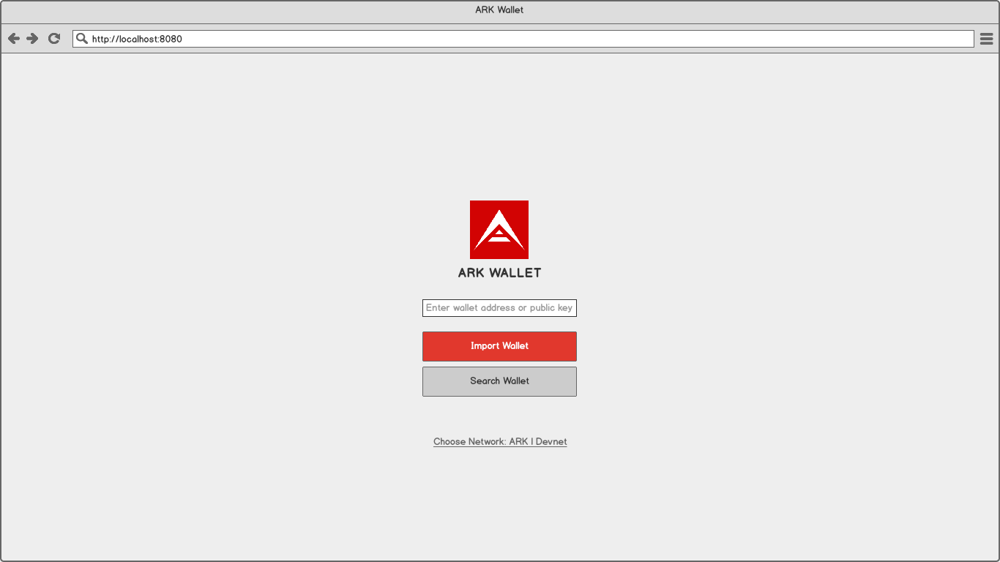
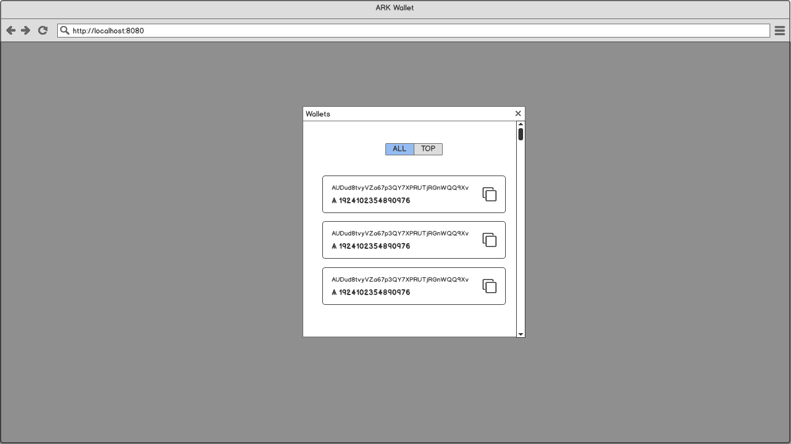
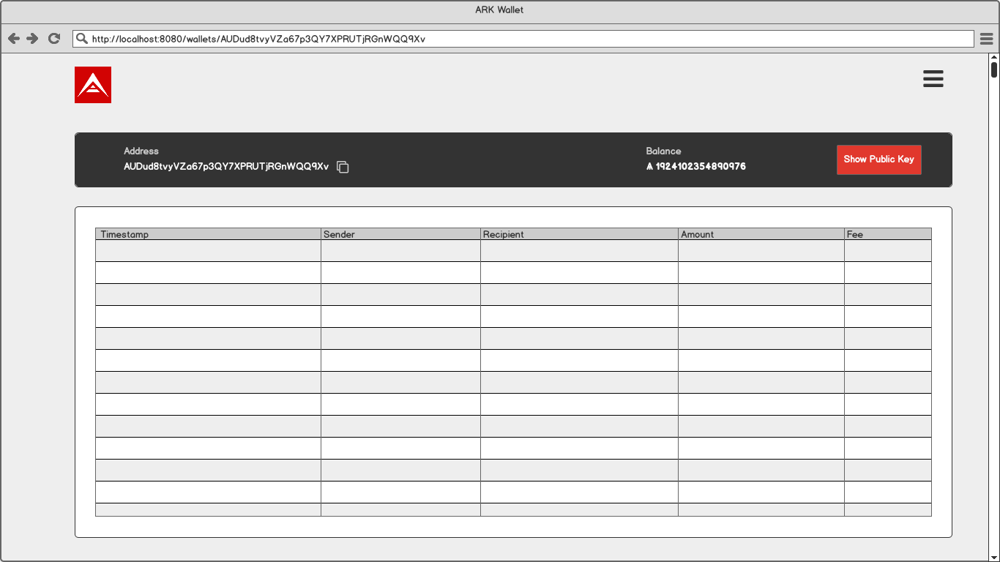
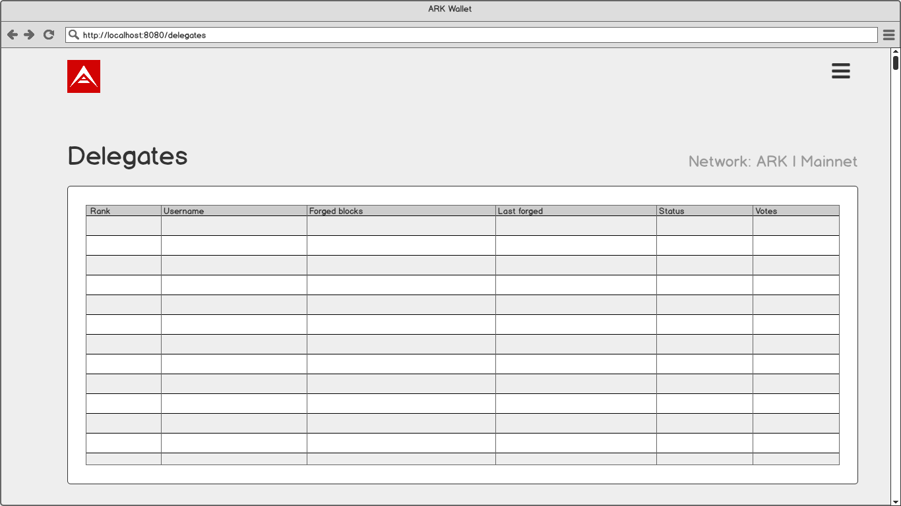

# Mockups

For the mockups I used the [Balsamiq Wireframes](https://balsamiq.com/).

|  |  |
| :------------------------------------------------------: | :--------------------------------------------------------------: |
|                    **Import Wallet**                     |                   **All / Top Wallets Modal**                    |

|  |  |
| :-------------------------------------------------------: | :--------------------------------------------------: |
|                    **Wallet Summary**                     |                    **Delegates**                     |
